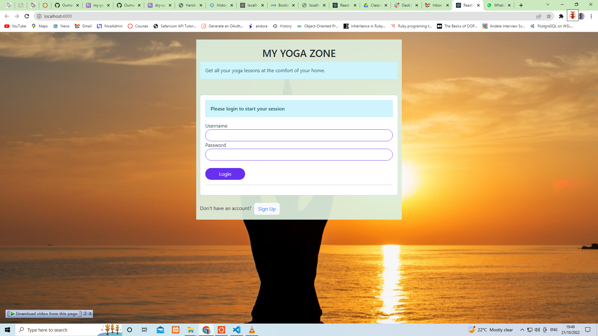
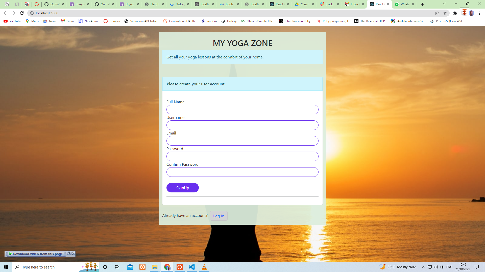
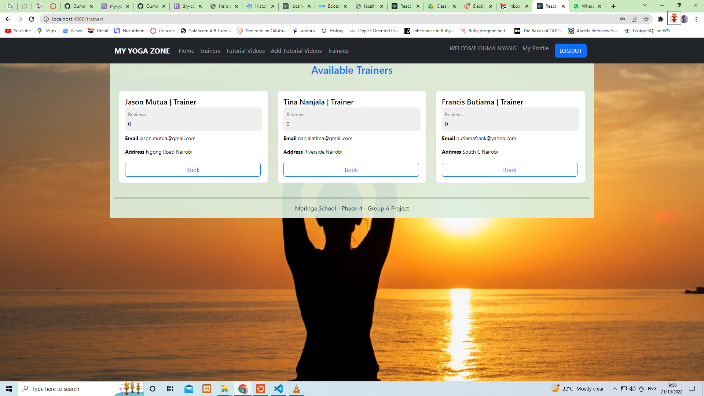
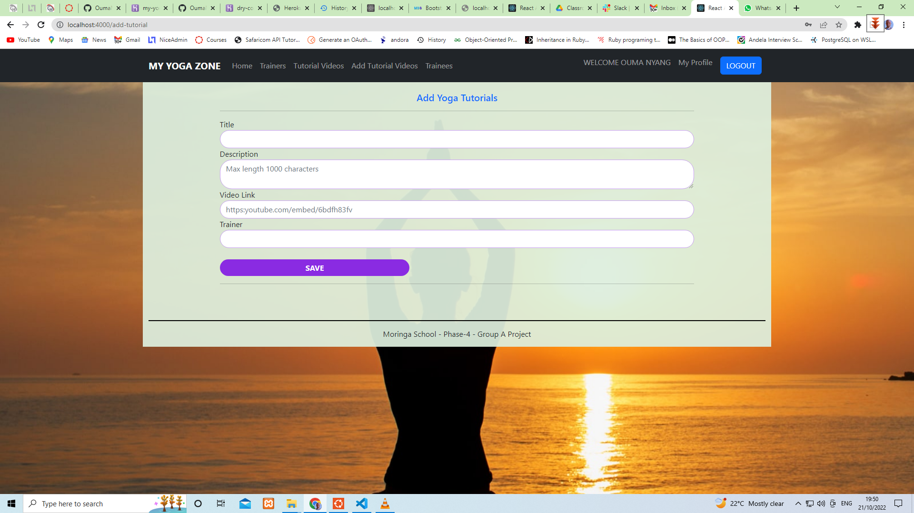
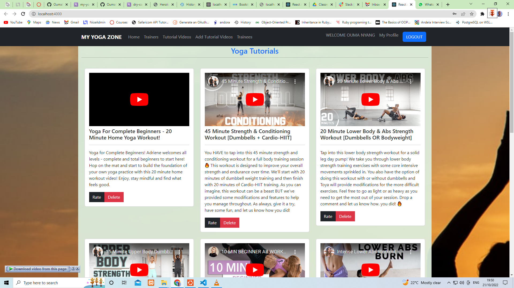

# MY YOGA ZONE
My yoga Zone is a web application that proovides reomote yoga lessons  to individuals at the comfort.The yoga lessons which are inform of videos are free of charge to all individuals . onl need toA trainee only need to  have an acces to the app ,book a trainer will be granted  all yoga tutorial videos under the trainer.

To get started with the project,you will be required to clone this repository.
Clone it here 

Run 
### ```npm install --prefix client```

Start your postgres server 

### ```sudo service postgresql start```
Enter your sudo password if pompted

Then  run
### ```bundle install```

Create the database
### ```rails db:create  ```

Run Database Migrations
### ```rails db:migrate ```

Seed Sample data
### ```rails db:seed```

Start the rail server 
### ```rails s```

Start the react frontend  client 
### ```npm start --prefix client```

If you have heroku cli installed, you can run the command below to start all the services 
### ```heroku local -f Procfile.dev```
 

The project backend server  will run on https://localhost:30000/  while 
The project frontend server  will run on https://localhost:4000/

Visit https://localhost:4000/ to view the project homepage.
You will be required to create an account before you are granted access to the full application. You are only required to create an account once as a trainee. For subsequent access , you will use the same username and password you provided during signup.

### Screenshots

LOGIN PAGE  
SIGNUP PAGE 

TRAINERS  
ADD YOGA TUTORIALS  
YOGA TUTORIALS  

### Project Technologies

* Ruby version
2.74
* Database  
Postresql Version 15 
* Frontend 
React -  npm Version 8.19.1

#### Copyright
Moringa School 2022 - Phase 4 - Group A Project

